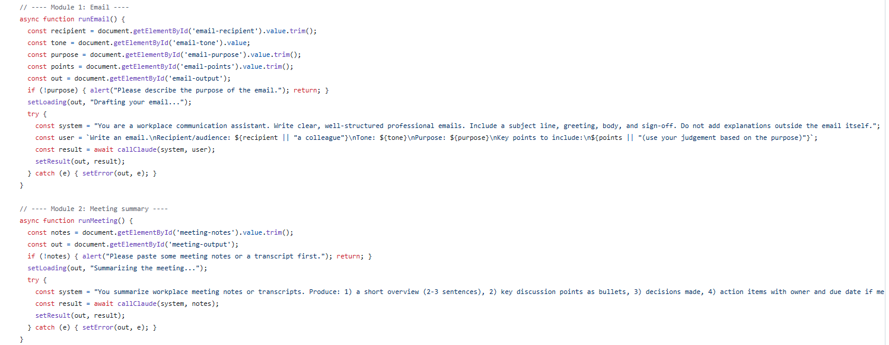
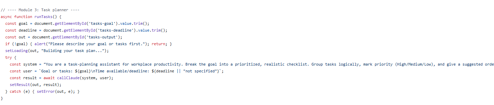

# Deskline — AI-Powered Workplace Productivity Assistant

  

A CAPACITI AI Skills Program project. Deskline is a browser-based assistant that automates five common workplace tasks using an AI model: **email drafting, meeting summarization, task planning, research assistance, and general chat.**

## Features
- 🗂️ Five purpose-built modules, each with its own tailored AI prompt — not one generic chatbot guessing what you need
- ⚡ Instant, in-browser results — no installation, backend, or build step
- 🧠 Documented prompt engineering behind every module (see `PROMPTS.md`)
- 🎨 Clean, custom-designed interface (no template UI kit)
- ✅ Built with responsible AI use in mind — see below

## Screenshots
_Add a screenshot of each module in action here — open `index.html`, fill in an example, and drag your screenshots into this repo (Add file → Upload files), then reference them below:_

```markdown



```

## Live demo
Open `index.html` in any browser — no installation or build step required. All you need to run it inside Claude.ai as an Artifact is to paste the code there; if you deploy it elsewhere, you'll need to connect it to an AI API of your choice (see "How it works" below).

## Project overview
Deskline was built to explore how AI tools and prompt engineering can remove friction from everyday workplace admin. Each module is a purpose-built prompt wrapped in a simple interface, rather than one generic chatbot expected to guess what's needed.

| Module | What it does |
|---|---|
| 01 · Email Drafting | Turns a purpose + bullet points into a ready-to-send, tone-matched email |
| 02 · Meeting Summarization | Converts raw notes/transcripts into an overview, decisions, and action items |
| 03 · Task Planner | Breaks a goal or workload into a prioritized, realistic checklist |
| 04 · Research Assistance | Produces a concise, structured briefing on a work-related question |
| 05 · Assistant Chat | Open-ended chat for anything the other modules don't cover |

## How it works
- The interface is a single-page HTML/CSS/JavaScript app (`index.html`) — no framework required.
- Each module sends a tailored **system prompt** (defining the AI's role and output format) plus the user's input to an AI model via a chat-completions style API call.
- Responses are rendered back into the module's output card. The chat module keeps conversation history so follow-up questions have context.
- See `PROMPTS.md` for the exact system prompts used and the reasoning behind each one.

## Responsible & ethical use
- Deskline is a **drafting and thinking aid**, not a decision-maker. Emails, summaries, and plans it produces are meant to be reviewed and edited by a human before being sent or acted on.
- The assistant does not store or transmit personal data anywhere beyond the single request needed to generate a response.
- Users should avoid pasting sensitive personal or confidential company information into any module.

## Project structure
```
AI-Productivity-Assistant/
├── index.html      # the full application (UI + logic)
├── README.md        # this file
├── PROMPTS.md        # prompt engineering documentation
└── LICENSE            # MIT license
```

## Author
Princess Nomcebo Hlongwane — CAPACITI AI Skills Program, AI-Powered Workplace Productivity Assistant project.

## License
Released under the [MIT License](LICENSE).
